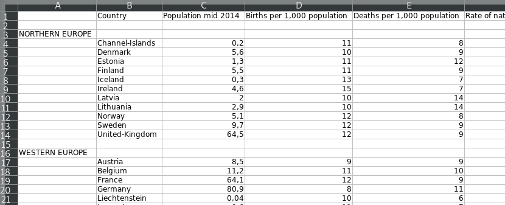
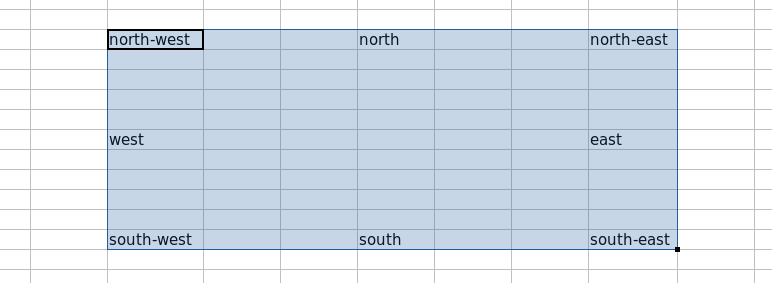
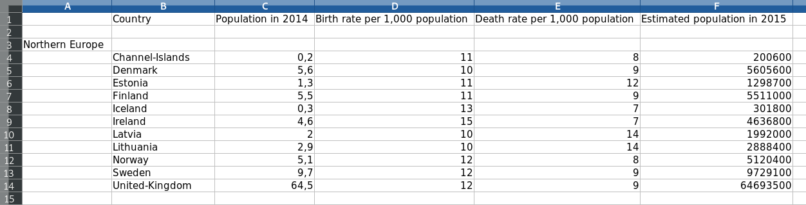

****************
Quick tour
****************

This Section provides a glimpse of the functionalities provided by the programs included in this package. For a thorough presentation of all functionalities the interested reader is referred to the next sections in this document. The first subsection shows how to populate a sqlite3 database with data extracted from a spreadsheet in :const:`ods` format ---though the format is irrelevant provided that it is readable; the second subsection restores the contents of the initial spreadsheet slightly modified.

=====================
Populating databases
=====================

.. index::
   single: sps2db.py
   pair: configuration; file
   single: database
   pair: database; table
   single: comment
   pair: association; one-to-many
   pair: association; many-to-many

In this tour the file :file:`examples/spsheets/population.ods` is used. It shows different demographic data for all european countries divided in four different regions. The following picture shows a partial view of its contents

The purpose of this simple tour is to show how to create a database with two tables:

1. The first contains the region each country belongs to.

2. The second contains the demographic data shown in columns C, D, E and F for each country listed in column B, i.e.:

   a. Population in 2014 in millions

   b. Birth rate

   c. Death rate

   d. Rate of natural increase

To this end, a configuration file should be created. A configuration file contains the following information:

1. What tables should be created;

2. the name and type of each column; and,

3. how to populate each column.

The first table will be named ``region`` and the second one ``demography``. The schema of the table ``region`` consists of two columns:

1. A text column named ``region``

2. A second text column named ``country``

So that the configuration file should be started with an incomplete definition of the first table as follows:

.. code:: text

  region {
       region ... text;
       country ... text;
  }

where the ellipsis show that some additional specifications should be given there. Indeed, as it can be seen in the spreadsheet shown above, the list of countries and the region they belong to are given in four different blocks. The first one, *Northern Europe*, specifies the region in cell ``$A3`` and the countries are given in the range ``$A4:$A14``. Thus, the following configuration file:

.. code:: text
	  
  region {
       region $A3 text;
       country $B4:$B14 text;
  }

can be used to populate a sqlite3 database with data for all countries in the first block, *Northern Europe*. To add to the database information for all the other countries, it just suffices to repeat the same procedure with each one, resulting the following configuration file:

.. code:: text

  region {
       region $A3 text;
       country $B4:$B14 text;

       region $A16 text;
       country $B17:$B25 text;

       region $A27 text;
       country $B28:$B37 text;

       region $A39 text;
       country $B40:$B54 text;
  }

Since the first block should always specify the type of each column, the type can be dropped from the remaining blocks:

.. code:: text

  region {
       region $A3 text;
       country $B4:$B14 text;

       region $A16;
       country $B17:$B25;

       region $A27;
       country $B28:$B37;

       region $A39;
       country $B40:$B54;
  }
	  
Finally, lines following the character ``#`` are considered comments:

.. code:: text
	  
  region {

       # each country and region are given in text cells

       # Northern Europe
       region $A3 text;
       country $B4:$B14 text;

       # Western Europe
       region $A16;
       country $B17:$B25;

       # Eastern Europe
       region $A27;
       country $B28:$B37;

       # Southern Europe
       region $A39;
       country $B40:$B54;
  }
  
Next, the configuration file is extended with the definition of the second table, ``demography``. It should contain, for each country, the demographic information shown in the spreadsheet. The next configuration file shows the specification for extracting data for the first region:

.. code:: text

  demography {

       # This table records demographic information of each european
       # country. While countries are given as text, all rates are
       # either integer or real numbers.
	   
       # Northern Europe
       country $B4:$B14 text;
       population $C4:$C14 real;	# in millions
       birth_rate $D4:$D14 integer;
       death_rate $E4:$E14 integer;
       increase_rate $F4:$F14 real;	# positive rates mean growth
                                        # and negative mean decrement
  }
	  
It is important to note that while each block in the table ``region``
create an association of *one-to-many* (i.e., one region attached to
several countries), the second table create an association of
*many-to-many*. In the second case, the number of cells in each column
should be strictly the same and the result consists of creating a
*one-to-one* pairing of all columns in the specification file. The
final specification for the second table is given below, where the
type of each column (following the first one) is removed:

.. code:: text

  demography {

       # This table records demographic information of each european
       # country. While countries are given as text, all rates are
       # either integer or real numbers.

       # Northern Europe
       country $B4:$B14 text;
       population $C4:$C14 real;	# in millions
       birth_rate $D4:$D14 integer;
       death_rate $E4:$E14 integer;
       increase_rate $F4:$F14 real;	# positive rates mean growth
                                        # and negative mean decrement
       # Western Europe
       country $B17:$B25;
       population $C17:$C25;
       birth_rate $D17:$D25;
       death_rate $E17:$E25;
       increase_rate $F17:$F25;

       # Eastern Europe
       country $B28:$B37;
       population $C28:$C37;
       birth_rate $D28:$D37;
       death_rate $E28:$E37;
       increase_rate $F28:$F37;
       
       # Southern Europe
       country $B40:$B54;
       population $C40:$C54;
       birth_rate $D40:$D54;
       death_rate $E40:$E54;
       increase_rate $F40:$F54;
  }

The resulting configuration file with the specification of both tables can be found in :file:`examples/population-db.conf`.

Finally, to create a sqlite3 database with the contents in the spreadsheet given in :file:`examples/spsheets/population.ods` and the configuration file shown above, the following command should be issued:

.. code:: bash

  $ sps2db.py --configuration examples/config/population-db.conf
              --db population.sqlite
              --spreadsheet examples/spsheets/population.ods

	      
========================
Populating spreadsheets
========================

.. index::
   single: db2sps.py
   pair: configuration; file
   single: literal
   single: reference point
   single: offset
   single: query
   single: direction
   single: formula

To populate a spreadsheet with information from a sqlite3 database, the script :program:`db2sps.py` should be used. The purpose of this exercise is to use the information stored in the database :file:`population.sqlite` in the preceding section (and distributed in :file:`examples/db/population.sqlite`)  to generate a spreadsheet with the population in 2014 and the estimated population in 2015, from the birth and death rate ---the *rate of natural increase* could be used for the same purpose, but the *birth* and *death rate* are used instead to enrich the presentation.

Therefore, the resulting spreadsheet should contain six columns:

1. The first one is used to write the region all countries below it belong to.

2. The second column should show the country's name.

3. The next four columns should show the following information:

   a. Population in 2014.

   b. Birth rate per 1,000 population.

   c. Death rate per 1,000 population.

   d. Estimated population in 2015.

The configuration file for populating spreadsheets specifies the contents of different sheets in different blocks defined between curly brackets. The following configuration file writes the headers of all columns, and the name of the first region:

.. code:: text

  {
	# -- Global headers
	$B1 "Country";
	$C1 "Population in 2014";
	$D1 "Birth rate per 1,000 population";
	$E1 "Death rate per 1,000 population";
	$F1 "Estimated population in 2015";

	# -- Northern Europe
	$A3 "Northern Europe";
  }

As it can be seen, literals can be written into any cell directly. However, it is also possible to declare a literal globally in the configuration file and to give it a name:

.. code:: text

  # -- Literals

  # Next, a literal is defined for each region
  literal northern_europe
        "Northern Europe"

  # -- Spreadsheet
  {
	# -- Global headers
	$B1 "Country";
	$C1 "Population in 2014";
	$D1 "Birth rate per 1,000 population";
	$E1 "Death rate per 1,000 population";
	$F1 "Estimated population in 2015";

	# -- Northern Europe
	$A3 literal.northern_europe;
  }

And the literal can then be used in the definition of the spreadsheet preceding its name with the preffix ``literal``, as shown in the last line.

An important advantage of defining *literals* is that the package :mod:`spsbot` automatically computes 8 reference points of the area where they are inserted: the north-west, north, north-east, west, east, south-west, south and south-east ---in the running example, the literal takes only one cell so that all reference points are the same, but it is also possible to insert the same literal in a rectangular region of cells. These reference points are shown in the next figure with regard to the shaded area:

Four of these reference points are shorten as follows: north-west (``nw``), north-east (``ne``), south-west (``sw``) and south-east ---``se``; the other four are denoted in the same way: ``north``, ``west``, ``east`` and ``south``.
	 
The reference points of a literal can be used with the notation ``literal.<literal name>.<reference point>``, e.g., ``literal.northern_europe.se``, ``literal.northern_europe.north``, ... and they can be used to compute the location of other cells by adding an offset of the form ``+ (columns offset, rows offset)`` to the reference point. The operator ``+`` is mandatory, so that to substract a value a negative offset must be given instead. For example ``literal.northern_europe.se + (1, 1)`` would be cell ``$B4``, and ``literal.northern_europe.north + (0, -1)`` is the cell ``$A2``, as the literal ``northern_europe`` is inserted in the cell ``$A3`` according to the configuration file shown above.

To insert data extracted from the database it is necessary to define a *query*. For example, the following query (to be added to the configuration file) retrieves the population in 2014, birth and death rate of all countries in the Northern Europe region:

.. code:: text

  # -- Queries
  query northern_europe
    "select population, birth_rate, death_rate from region, demography
            where region.country=demography.country and
	          region.region='Northern Europe'"

Now, to insert its contents into the spreadsheet it is necessary to define:

1. The result of the query will be a list of tuples and thus, it is necessary to specify where to write the first one. In our example, the first line will span three columns (one for each field appearing in the query) from the cell one column to the right and one row below the literal ``northern_europe``, to the cell three columns to the right in the same row. This range is written as: ``$literal.northern_europe.se + (2,1):$literal.northern_europe.se + (4,1)``

2. The direction to follow to write the next tuples. In this example, all lines should be written below the previous one and hence the direction will be ``down``.

3. Finally, it is necessary to specify the query to execute: ``query.northern_europe``.

Resulting in the line to add to the configuration file: ``$literal.northern_europe.se + (2,1):$literal.northern_europe.se + (4,1) down query.northern_europe;``

A few remarks follow:

1. The range used to define where the first line is written is specified with two end points separated with a colon ``:``. This is customary practice when defining ranges with spreadsheets.

2. The evaluation of the reference points is preceded by the dollar sign ``$`` as they refer to cell names. This is also customary practice when dealing with cells in spreadsheets.

3. Although the query is named ``northern_europe`` it does not clash with the literal with the same name as all references to literals and queries must be preffixed by the keyword ``literal`` or ``query`` respectively, disambiguating the meaning of the name used thereafter.

The result is shown below:

.. code:: text

  # -- Literals

  # Next, a literal is defined for each region
  literal northern_europe
	"Northern Europe"

  # -- Queries
  query northern_europe
   "select population, birth_rate, death_rate from region, demography
           where region.country=demography.country and
	         region.region='Northern Europe'"

  # -- Spreadsheet
  {
	# -- Global headers
	$B1 "Country";
	$C1 "Population in 2014";
	$D1 "Birth rate per 1,000 population";
	$E1 "Death rate per 1,000 population";
	$F1 "Estimated population in 2015";

	# -- Northern Europe
	$A3 literal.northern_europe;
	$literal.northern_europe.se + (2,1) :
	  $literal.northern_europe.se + (4,1)
	  down query.northern_europe;
  }
	  
Adding now the name of each country in the region *Northern Europe* is much simpler. The resulting configuration file (which adds a query, ``countries_northern`` and a new line to the spreadsheet to insert its result) is shown below:

.. code:: text

  # -- Literals

  # Next, a literal is defined for each region
  literal northern_europe
	"Northern Europe"

  # -- Queries
  query countries_northern
   "select country from region where region='Northern Europe'"

  query northern_europe
   "select population, birth_rate, death_rate from region, demography
           where region.country=demography.country and
	         region.region='Northern Europe'"

  # -- Spreadsheet
  {
	# -- Global headers
	$B1 "Country";
	$C1 "Population in 2014";
	$D1 "Birth rate per 1,000 population";
	$E1 "Death rate per 1,000 population";
	$F1 "Estimated population in 2015";

	# -- Northern Europe
	$A3 literal.northern_europe;
	$literal.northern_europe.se + (1,1) :
	 $literal.northern_europe.se + (1,1)
	 down query.countries_northern;
	$literal.northern_europe.se + (2,1) :
	 $literal.northern_europe.se + (4,1)
	 down query.northern_europe;
  }

To estimate the population of an arbitrary country in 2015 the
following formula should be used:

.. math::

   p\times 10^3 (10^3 + b - d)

where:

* *p* is the population in 2014;

* *b* is the *birth rate*; and,

* *d* is the *death rate*.

Thus, to estimate the population in the next year, a *formula* should be used. Formulas are just literals which start with the symbol ``=``. Let us consider the first row, which provides the different data for the first country in the range ``$literal.northern_europe.se + (2,1):$literal.northern_europe.se + (4,1)`` (which is ``C4:E4`` in our specific case) as shown in the last line of the specification file shown above. *p*, *b* and *d* are given respectively in cells ``$literal.northern_europe.se + (2,1)``, ``$literal.northern_europe.se + (3,1)`` and ``$literal.northern_europe.se + (4,1)``. Thus, the formula used to compute the estimated population in 2015 for the first country of the *Northern Europe* region is:

.. code:: text

  # the following literals are formulas instead and they are used to
  # estimate the population in 2015
  literal estimated_northern
      "=$literal.northern_europe.se + (2,1) * 1000 *
        ( 1000 + $literal.northern_europe.se + (3,1) -
	         $literal.northern_europe.se + (4,1) )"

The result of this formula should be added to the last column. To decide the right location where to write the result of this formula it is important to note that queries also automatically create reference points, and thus, they can be used to compute the location of adjacent cells. To make the example more meaningful, reference points from different regions (coming from a literal and a query) are used next to specify where to write the data generated by the previous formula.

.. code:: text

  $literal.northern_europe.se + (5,1) :
     $query.northern_europe.se + (1,0)
     down literal.estimated_northern;

As it should be written, in the first column, either ``$literal.northern_europe.se + (5,1)`` or ``$query.northern_europe.ne + (1,0)`` refer to the same cell, ``$F4``. Data is then written downwards, i.e., with direction *down*. Finally, the last cell where the results should be written is exactly the next one to the right of the last cell used to write the population, birth and death rate, ``$query.northern_europe.se + (1,0)``.

The full contents of the configuration file are shown below:

.. code:: text

  # -- Literals

  # Next, a literal is defined for each region
  literal northern_europe
	"Northern Europe"

  # the following literals are formulas instead and they are used to
  # estimate the population in 2015
  literal estimated_northern
      "=$literal.northern_europe.se + (2,1) * 1000 *
        ( 1000 + $literal.northern_europe.se + (3,1) -
	         $literal.northern_europe.se + (4,1) )"

  # -- Queries
  query countries_northern
      "select country from region where region='Northern Europe'"

  query northern_europe
   "select population, birth_rate, death_rate from region, demography
           where region.country=demography.country and
	         region.region='Northern Europe'"

  # -- Spreadsheet
  {
	# -- Global headers
	$B1 "Country";
	$C1 "Population in 2014";
	$D1 "Birth rate per 1,000 population";
	$E1 "Death rate per 1,000 population";
	$F1 "Estimated population in 2015";

	# -- Northern Europe
	$A3 literal.northern_europe;
	$literal.northern_europe.se + (1,1) :
	   $literal.northern_europe.se + (1,1)
	   down query.countries_northern;
	$literal.northern_europe.se + (2,1) :
	   $literal.northern_europe.se + (4,1)
	   down query.northern_europe;
	$literal.northern_europe.se + (5,1) :
	   $query.northern_europe.se + (1,0)
	   down literal.estimated_northern;
  }

Now, by running the script :program:`db2sps.py` in the following way:
  
.. code:: bash

  $ sps2db.py --configuration examples/config/population-sps.conf
              --db examples/db/population.sqlite
              --spreadsheet population.xlsx
	      --sheetname "Quick Tour"

a spreadsheet :file:`population.xlsx` is created with a sheet named
`Quick Tour` which contains the data for all countries in the Northern
Europe region as shown in the following figure:

Now, to generate data for all countries in the *Western Europe*, the
literal ``estimated_western``, which is a formula, is necesary ---note
that in this case, the label ``Western Europe`` is written explicitly
in the design of the spreadsheet. Likewise, the following queries are
added: ``countries_western`` and ``western_europe``. All of them are
analogous to the literal and queries defined for the countries in the
*Northern Europe* region. The resulting configuration file is shown
next:

.. code:: text

  # -- Literals

  # Next, a literal is defined for each region
  literal northern_europe
	"Northern Europe"

  # the following literals are formulas instead and they are used to
  # estimate the population in 2015
  literal estimated_northern
      "=$literal.northern_europe.se + (2,1) * 1000 *
        ( 1000 + $literal.northern_europe.se + (3,1) -
	         $literal.northern_europe.se + (4,1) )"

  literal estimated_western
      "=$query.countries_western.ne + (1,0) * 1000 *
        ( 1000 + $query.countries_western.ne + (2,0) -
	         $query.countries_western.ne + (3,0) )"

  # -- Queries
  query countries_northern
      "select country from region where region='Northern Europe'"

  query countries_western
      "select country from region where region='Western Europe'"

  query northern_europe
   "select population, birth_rate, death_rate from region, demography
           where region.country=demography.country and
	         region.region='Northern Europe'"

  query western_europe
   "select population, birth_rate, death_rate from region, demography
           where region.country=demography.country and
	         region.region='Western Europe'"

  # -- Spreadsheet
  {
	# -- Global headers
	$B1 "Country";
	$C1 "Population in 2014";
	$D1 "Birth rate per 1,000 population";
	$E1 "Death rate per 1,000 population";
	$F1 "Estimated population in 2015";

	# -- Northern Europe
	$A3 literal.northern_europe;
	$literal.northern_europe.se + (1,1) :
	   $literal.northern_europe.se + (1,1)
	   down query.countries_northern;
	$literal.northern_europe.se + (2,1) :
	   $literal.northern_europe.se + (4,1)
	   down query.northern_europe;
	$literal.northern_europe.se + (5,1) :
	   $query.northern_europe.se + (1,0)
	   down literal.estimated_northern;

	# -- Western Europe
	$query.countries_northern.sw + (-1,2)
	   "Western Europe";
	$query.countries_northern.sw + (0,2) :
	   $query.countries_northern.sw + ( 0, 2)
	   down query.countries_western;
	$query.countries_northern.sw + (1,2) :
	   $query.countries_northern.sw + ( 3, 2)
	   down query.western_europe;
	$query.countries_northern.sw + (4,2) :
	   $query.western_europe.se + (1,0)
	   down literal.estimated_western;
  }

In this case, the reference point used to compute where to insert data
(as shown in the contents of the spreadsheet to generate) is
``$query.countries_northern.sw``. In addition, the formula used to
estimate the population in 2015 uses the reference point
``$query.countries_western.ne`` instead of the literal
``western_europe``, as in the case of the *Northern Europe* region.

To conclude, the configuration file used to generate data for all
regions can be found in ``examples/config/population-sps.conf``. The
resulting spreadsheet generated with the command shown above is
accessible in ``examples/spsheets/population.xlsx``.
